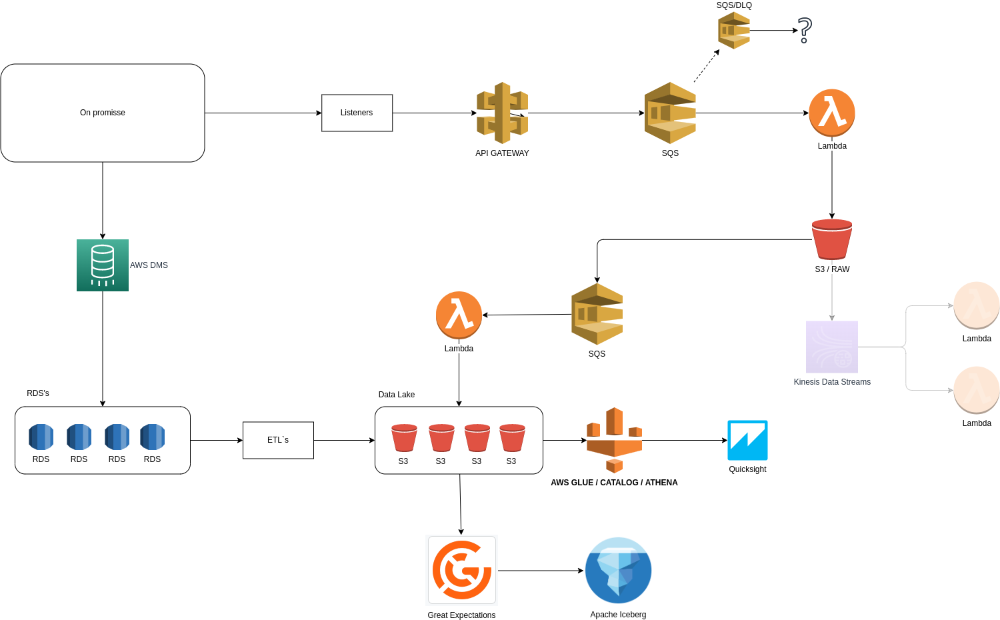

# GB Challenge

## Case 1:


## Case 2:

### Steps:
- Created the table schemas;
- ETL:
    - Loaded the data from files obtained from GB;
        - Made the specific queries to ingest the data on target tables;
    - Created the ETL to process the queries
    - Load the data to specific target tables
- SPOTIFY
    - Created the app and got the credentials
    - Created the script to find the GB podcasts with episodes


### Requirements:

Recent and functional [Docker][docker] and [Docker Compose][docker-compose].

[docker]: https://docs.docker.com/engine/install/
[docker-compose]: https://docs.docker.com/compose/install/

### How to run

Copy the `.env-template` to `.env` file and change it for your credentials.

The application should be up and running in one command.

```sh
docker-compose up -d --force-recreate --remove-orphans
```


### Comandos:
Enter on contaner:

```sh
docker-compose exec -it app /bin/bash
```

Into container you can run the fallows commands:

```python3
python3 scripts/drop_tables.py
```
output
```sh
Dropped sales_report
Dropped sales_by_year_month
Dropped sales_by_brand_category
Dropped sales_by_brand_year_month
Dropped sales_by_category_year_month
Dropped spotify_podcast
Dropped spotify_podcast_episodes
Dropped spotify_gb_podcast_episodes
```


```python3
python3 scripts/create_tables.py
```
output
```sh
Created sales_report
Created sales_by_year_month
Created sales_by_brand_category
Created sales_by_brand_year_month
Created sales_by_category_year_month
Created spotify_podcast
Created spotify_podcast_episodes
Created spotify_gb_podcast_episodes
```


```python3
python3 scripts/load_data.py
```
output

```sh
START AT: 19/03/2023 23:06:23
Truncated sales_report
---------
{ 'sales_report': 3000 }
END AT: 19/03/2023 23:06:27
```

```python3
python3 scripts/etl.py
```
output

```sh
START AT: 19/03/2023 23:08:28
Truncated sales_by_category_year_month
Truncated sales_by_brand_category
Truncated sales_by_year_month
Truncated sales_by_brand_year_month
---------
{'sales_by_brand_category': 25,
 'sales_by_brand_year_month': 120,
 'sales_by_category_year_month': 120,
 'sales_by_year_month': 24}
END AT: 19/03/2023 23:08:32
```

```python3
python3 scripts/get_podcasts.py
```
output

```sh
START AT: 19/03/2023 23:10:19
Truncated spotify_podcast
Truncated spotify_gb_podcast_episodes
Truncated spotify_podcast_episodes
{'podcast_id': {'episodes': {'qty': 100, 'qty_gb': 0}},
 'podcast_id': {'episodes': {'qty': 6, 'qty_gb': 0}},
 'podcast_id': {'episodes': {'qty': 31, 'qty_gb': 2}},
 'podcast_id': {'episodes': {'qty': 100, 'qty_gb': 0}},
 'podcast_id': {'episodes': {'qty': 54, 'qty_gb': 0}},
 'podcast_id': {'episodes': {'qty': 9, 'qty_gb': 0}},
 'podcast_id': {'episodes': {'qty': 100, 'qty_gb': 0}},
 'podcast_id': {'episodes': {'qty': 49, 'qty_gb': 0}},
 'podcast_id': {'episodes': {'qty': 69, 'qty_gb': 8}},
 'podcast_id': {'episodes': {'qty': 3, 'qty_gb': 0}},
 'podcast_id': {'episodes': {'qty': 24, 'qty_gb': 0}},
 'podcast_id': {'episodes': {'qty': 12, 'qty_gb': 0}},
 'podcast_id': {'episodes': {'qty': 75, 'qty_gb': 0}},
 'podcast_id': {'episodes': {'qty': 100, 'qty_gb': 0}},
 'podcast_id': {'episodes': {'qty': 33, 'qty_gb': 0}},
 'podcast_id': {'episodes': {'qty': 48, 'qty_gb': 0}},
 'podcast_id': {'episodes': {'qty': 18, 'qty_gb': 0}},
 'podcast_id': {'episodes': {'qty': 15, 'qty_gb': 0}},
 'podcast_id': {'episodes': {'qty': 21, 'qty_gb': 0}},
 'podcast_id': {'episodes': {'qty': 2, 'qty_gb': 0}},
 'podcast_id': {'episodes': {'qty': 1, 'qty_gb': 0}},
 'podcast_id': {'episodes': {'qty': 19, 'qty_gb': 0}},
 'podcast_id': {'episodes': {'qty': 1, 'qty_gb': 0}},
 'podcast_id': {'episodes': {'qty': 22, 'qty_gb': 0}},
 'podcast_id': {'episodes': {'qty': 6, 'qty_gb': 0}},
 'podcast_id': {'episodes': {'qty': 35, 'qty_gb': 0}},
 'podcast_id': {'episodes': {'qty': 18, 'qty_gb': 0}},
 'podcast_id': {'episodes': {'qty': 4, 'qty_gb': 0}},
 'podcast_id': {'episodes': {'qty': 21, 'qty_gb': 0}},
 'podcast_id': {'episodes': {'qty': 32, 'qty_gb': 0}},
 'podcast_id': {'episodes': {'qty': 100, 'qty_gb': 0}},
 'podcast_id': {'episodes': {'qty': 9, 'qty_gb': 0}},
 'podcast_id': {'episodes': {'qty': 61, 'qty_gb': 0}},
 'podcast_id': {'episodes': {'qty': 16, 'qty_gb': 0}},
 'podcast_id': {'episodes': {'qty': 47, 'qty_gb': 0}},
 'podcast_id': {'episodes': {'qty': 63, 'qty_gb': 0}},
 'podcast_id': {'episodes': {'qty': 25, 'qty_gb': 0}},
 'podcast_id': {'episodes': {'qty': 60, 'qty_gb': 0}},
 'podcast_id': {'episodes': {'qty': 1, 'qty_gb': 0}},
 'podcast_id': {'episodes': {'qty': 4, 'qty_gb': 0}},
 'podcast_id': {'episodes': {'qty': 2, 'qty_gb': 0}},
 'podcast_id': {'episodes': {'qty': 1, 'qty_gb': 0}},
 'podcast_id': {'episodes': {'qty': 18, 'qty_gb': 0}},
 'podcast_id': {'episodes': {'qty': 22, 'qty_gb': 0}},
 'podcast_id': {'episodes': {'qty': 60, 'qty_gb': 0}},
 'podcast_id': {'episodes': {'qty': 12, 'qty_gb': 0}},
 'podcast_id': {'episodes': {'qty': 4, 'qty_gb': 0}},
 'podcast_id': {'episodes': {'qty': 1, 'qty_gb': 0}},
 'podcast_id': {'episodes': {'qty': 14, 'qty_gb': 0}},
 'podcast_id': {'episodes': {'qty': 93, 'qty_gb': 0}},
 'saved': {'episodes': {'qty': 1641},
           'gb_episodes': {'qty': 10},
           'podcasts': {'qty': 50}},
 'source': {'episodes': {'qty': 1641},
            'gb_episodes': {'qty': 10},
            'podcast': {'qty': 50}}}
END AT: 19/03/2023 23:10:30
```